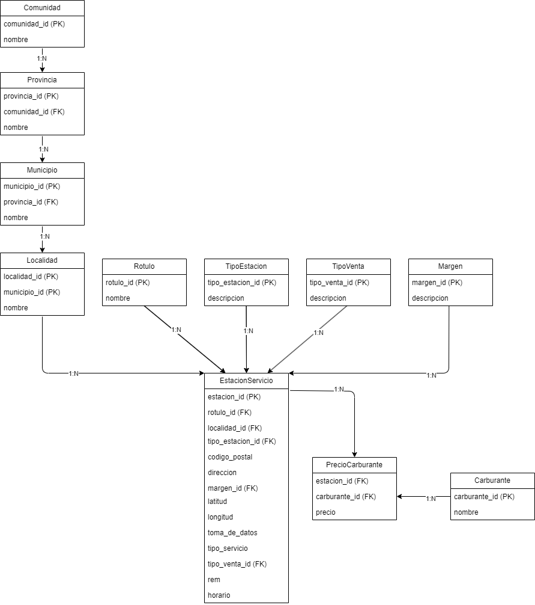

# Proyecto de Base de Datos: Estaciones de Servicio

## Descripción del Proyecto
Este proyecto implementa una base de datos relacional diseñada para gestionar información sobre estaciones de servicio en España. 
Incluye datos de comunidades, provincias, municipios, localidades, estaciones de servicio y precios de carburantes, permitiendo realizar 
consultas avanzadas como análisis de precios, localización y estadísticas de empresas.

---

## Diagrama Entidad-Relación
El diseño de la base de datos se representa en el siguiente diagrama ER, que describe las tablas principales y sus relaciones:

---

## Estructura del Proyecto
El proyecto incluye:

1. **Tablas principales**:
    - **Comunidad**: Información de las comunidades autónomas.
    - **Provincia**: Provincias asociadas a comunidades.
    - **Municipio**: Municipios asociados a provincias.
    - **Localidad**: Localidades asociadas a municipios.
    - **Rotulo**: Marcas comerciales de las estaciones de servicio.
    - **TipoEstacion**: Clasificación de las estaciones (terrestres o marítimas).
    - **TipoVenta**: Tipos de venta.
    - **Margen**: Información sobre el tipo de margen de la estación.
    - **EstacionServicio**: Información detallada de cada estación (ubicación, tipo de estación, horarios, etc.).
    - **Carburante**: Tipos de combustibles ofrecidos.
    - **PrecioCarburante**: Precios de los combustibles en cada estación.

2. **Relaciones Clave**:
    - Cada comunidad contiene varias provincias.
    - Las provincias se dividen en municipios, que a su vez contienen localidades.
    - Las localidades tienen múltiples estaciones de servicio.
    - Una estación puede ofrecer múltiples carburantes, con precios específicos por tipo de combustible.

---

## Consultas Implementadas
Se incluyen consultas SQL para responder preguntas clave:

1. **Empresa con más estaciones terrestres**:
    - Busca el rótulo (empresa) que tiene la mayor cantidad de estaciones terrestres.
    - Índices creados:
      - `CREATE INDEX idx_tipoestacion_descripcion ON TipoEstacion (descripcion);`
      - `CREATE INDEX idx_rotulo_nombre ON Rotulo (nombre);`

2. **Empresa con más estaciones marítimas**:
    - Encuentra la marca con mayor presencia en estaciones marítimas.
    - Índices reutilizados:
      - `idx_tipoestacion_descripcion` para filtrar estaciones marítimas.
      - `idx_rotulo_nombre` para agrupar por rótulo.

3. **Estación más barata en Madrid para Gasolina 95 E5**:
    - Localiza la estación más económica para este carburante dentro de la Comunidad de Madrid.
    - Índices creados:
      - `CREATE INDEX idx_carburante_nombre ON Carburante (nombre);`
      - `CREATE INDEX idx_precio_carburante ON PrecioCarburante (precio, estacion_id);`
      - `CREATE INDEX idx_comunidad_nombre ON Comunidad (nombre);`

4. **Estación más cercana al centro de Albacete para Gasóleo A**:
    - Calcula la estación más cercana dentro de un radio de 10 km desde el centro de Albacete.
    - Índices creados:
      - `CREATE INDEX idx_precio_carburante_id ON PrecioCarburante (carburante_id, precio);`
      - `CREATE INDEX idx_estacion_lat_lon ON EstacionServicio (latitud, longitud);`
      - `CREATE INDEX idx_provincia_nombre ON Provincia (nombre);`

5. **Provincia con el precio más caro de Gasolina 95 E5 en estaciones marítimas**:
    - Encuentra la provincia con el precio más alto para este carburante en estaciones marítimas.
    - Índices creados:
      - `CREATE INDEX idx_tipoestacion_id ON TipoEstacion (tipo_estacion_id);`
      - `CREATE INDEX idx_precio_carburante_id ON PrecioCarburante (carburante_id, precio);`
      - `CREATE INDEX idx_provincia_nombre ON Provincia (nombre);`

---

## Índices en el Proyecto
Para optimizar el rendimiento de las consultas, se han implementado los siguientes índices:

1. **Filtros en consultas**:
    - `idx_tipoestacion_descripcion` para clasificaciones terrestres/marítimas.
    - `idx_carburante_nombre` para filtrar por tipos de combustible.
    - `idx_comunidad_nombre` para búsquedas por comunidades autónomas.

2. **Uniones en tablas**:
    - `idx_precio_carburante` y `idx_precio_carburante_id` para asociar precios con estaciones.
    - `idx_provincia_nombre` para uniones relacionadas con provincias.

3. **Ordenación y cálculos**:
    - `idx_precio_carburante` para ordenaciones por precio.
    - `idx_estacion_lat_lon` para cálculos de distancia en consultas geográficas.

---

## Variables de Entorno
Por motivos de seguridad, no se proporciona el archivo de configuración `.json`. Es necesario configurar las siguientes variables de entorno para conectar la base de datos:

- **MYSQL_USER**: Usuario con permisos para acceder a la base de datos.
- **MYSQL_PASSWORD**: Contraseña del usuario.

---
